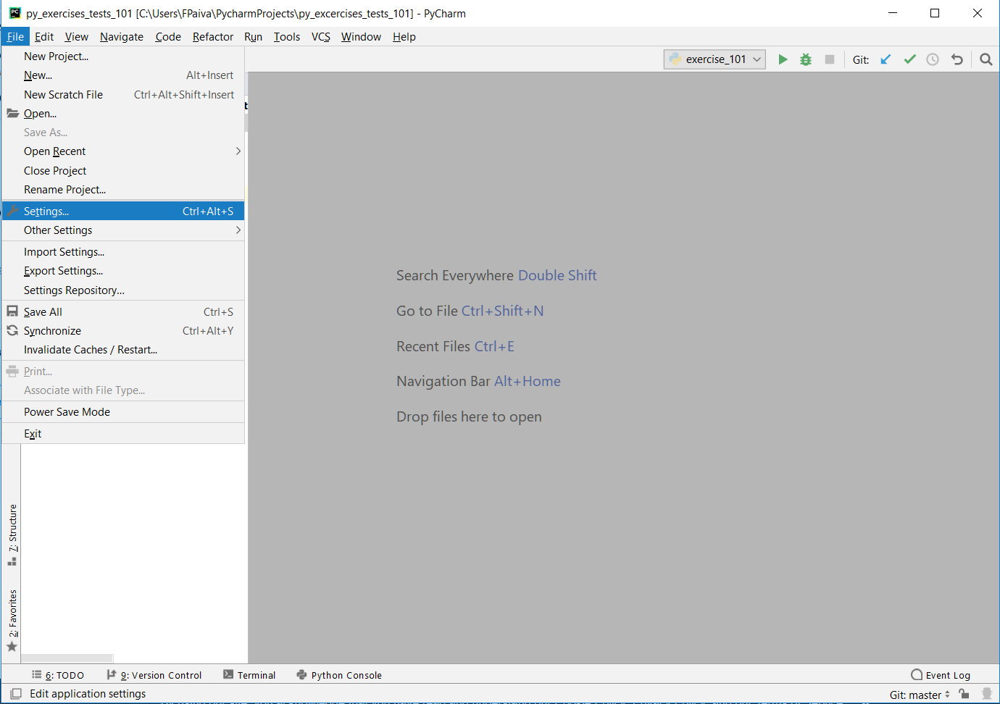
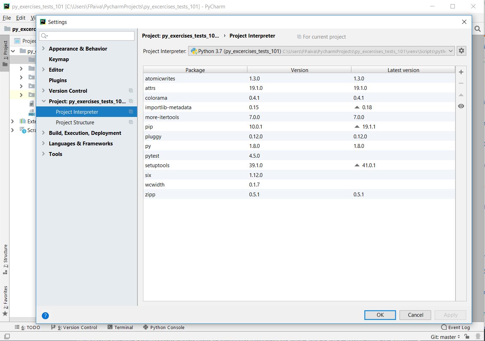

# Python  exercise 101 :taco:

The exercises come with two main files: 
 - exercise file
 - specs file
 
The object is you keep running the tests until they ALL pass! :star:

## Setup
1) Get the exercises

Let's get started. First clone this repo by running:

    $ git clone <ssh of this repo>
    
2) Install pytest

Depending on how you are using Python you need install pytest. 

    $ pip install pytest

If you are using Pycharm:

    1 - File> Settings > <Project name> interperter
    

    2 - left corner there is a + sign to add packages

    3 - add and install pytest

## Runing the Test & doing the Exercise :running::running: :boom::computer::boom::exclamation:

`cd` into the right directory.
Then what you are going to do is run the tests:

    $ pytest specs_101.py

Inside each exercise file you have some methods to complete.

Read the comment for guidance & run your tests to know that you're done.

Good luck :) :fire::pray::pray::fire: